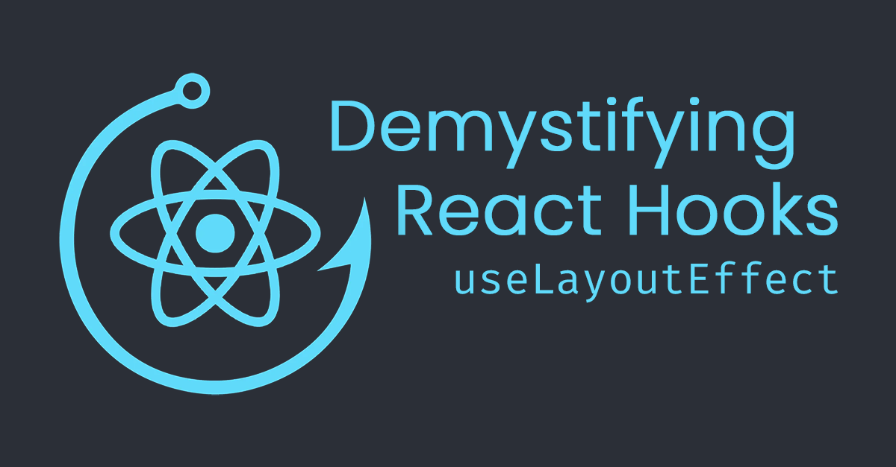
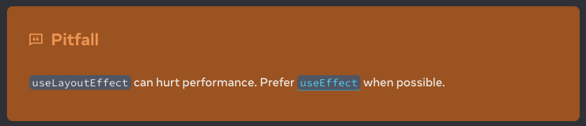
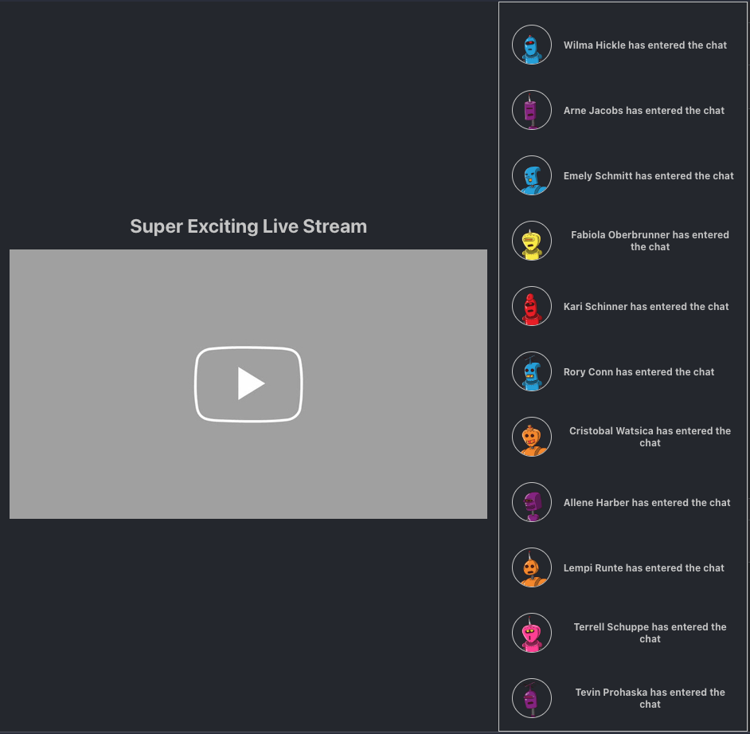
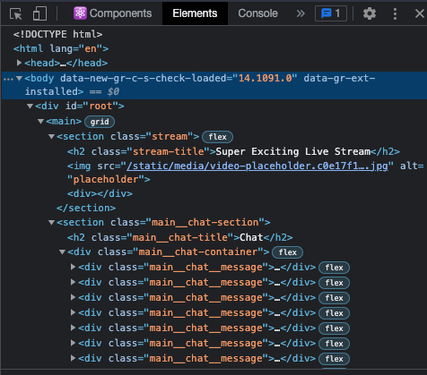
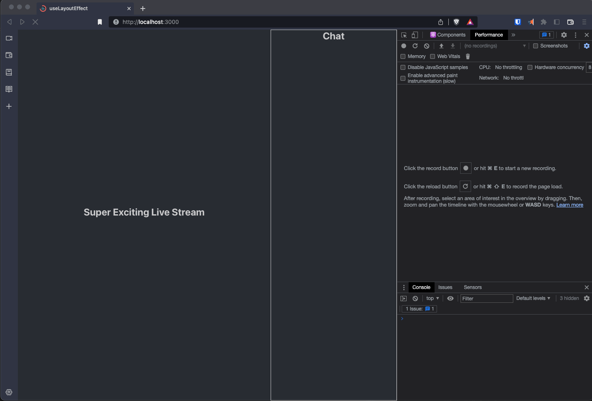
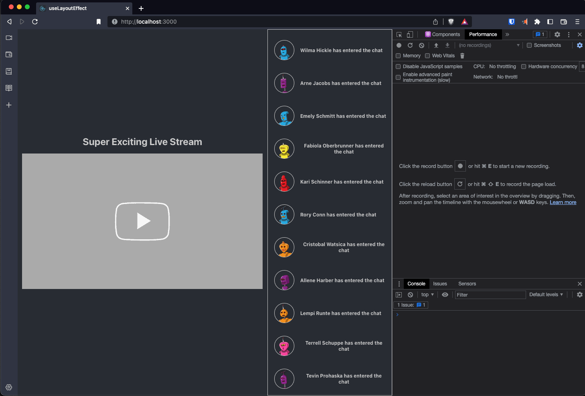
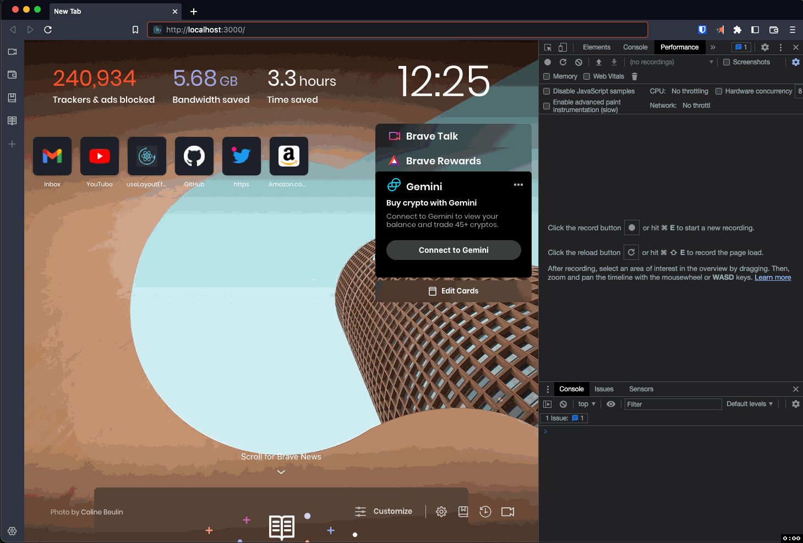

# Demystifying React Hooks – `useLayoutEffect`



In this article, we will explore when and how to use React’s `useLayoutEffect`
hook and how it relates to the `useEffect` Hook.

If you'd like, you can skim this as a
[Medium](https://medium.com/@austinrt/demystifying-react-hooks-uselayouteffect-eac6773822)
or
[dev.to](https://dev.to/austinrt/demystifying-react-hooks-uselayouteffect-17pp)
article.

## Getting Started

- `fork and clone`
- `cd client`
- `npm i`
- `npm start`

## Creating the Problem

Sure, `useLayoutEffect` is not something you'll use often. It actually took me
longer to think of a use case than to code out the example. It's kinda like
[the US Supreme Court's definition of obscenity](https://en.wikipedia.org/wiki/I_know_it_when_I_see_it),
"You know it when you see it."

The React beta docs offer a cool, albeit incredibly specific use case with
"[a tooltip that appears next to some element on hover. If there’s enough space, the tooltip should appear above the element, but if it doesn’t fit, it should appear below](https://beta.reactjs.org/reference/react/useLayoutEffect#usage)"...
if you'd like to check that out.

While you likely won't turn to `useLayoutEffect` often enough to need a snippet,
understanding how it works will help you better understand `useEffect`, which
you'll use daily as a React 18+ developer. And for the one time in your career
when you need to pull it out, you'll know precisely the right tool for the job.

## What is `useLayoutEffect`?

As every good developer pretends to do before Googling, let's turn to the
[docs](https://beta.reactjs.org/reference/react/useLayoutEffect).



The first thing we see on the page for `useLayoutEffect` is a bright orange
warning telling us not to use `useLayoutEffect`.

Got it.

Reading on, we find the following description:

<blockquote>
<code>useLayoutEffect</code> is a version of <code>useEffect</code> that fires before the browser repaints the screen.
</blockquote>
<br/>

Sweet.

If you understand `useEffect`, this is a pretty straightforward explanation of
`useLayoutEffect`. However, if you've found yourself here and don't have a firm
grasp on `useEffect`, I'd recommend reading up on
[`useEffect`](https://beta.reactjs.org/reference/react/useEffect) and
revisiting. And since you didn't take my advice, let's quickly recap
`useEffect`.

## `useEffect` Recap

`useEffect` calls an anonymous function after the values in its dependency array
have changed. It is asynchronous and non-blocking. It runs after the browser has
painted the screen and can optionally return a "clean-up" function. Essentially,
`useEffect` is all the old crusty component lifecycle methods rolled up into one
tidy hook.

`useEffect`'s primary purpose is to asynchronously run
[side effects](https://www.freecodecamp.org/news/react-useeffect-absolute-beginners/)
without blocking
[JavaScript's Single Thread](https://www.geeksforgeeks.org/why-javascript-is-a-single-thread-language-that-can-be-non-blocking/),
offering a more performant and responsive application resulting in a more
seamless User Experience.

In plain English, your React App won't wait on `useEffect` to finish doing its
thing before rendering the page. Your page will render while the `useEffect`
will run alongside the browser paint, and if your `useEffect` affects the UI, it
will only rerender what is needed. Fetching data from an API and updating state
is one of the most common use cases for `useEffect`.

So how does this compare to `useLayoutEffect`?

## `useEffect` vs. `useLayoutEffect`

`useLayoutEffect`'s signature is identical, but it is synchronous, blocking, and
runs before the browser paints. So these two are kind of exactly the same but
kind of exactly the opposite.

```js
useEffect(() => {
  // asynchronous, non-blocking, runs after the browser paints
}, [dependencyArray]);

useLayoutEffect(() => {
  // synchronous, blocking, runs before the browser paints
}, [dependencyArray]);
```

## Starter Code

Let's _finally_ dive into the code.

In `App.js`, you'll see our entire app that aims to simulate a Super Exciting
Live Stream with a chat functionality on the sidebar.



On lines 15 and 16, we're simply initializing a `ref` called `afterChatRef` and
a state called `messages`.

After our imports, we have a `setInterval` function that counts to a billion
every two milliseconds. React is getting better and better at outsmarting our
clunky code, so this is purely a way to slow down the application. And the
comment is just asking es-lint to cool it with the unused vars warning since
we're not doing anything with sum after incrementing it.

```js
setInterval(() => {
  let sum = 0;
  for (let i = 0; i < 1e9; i++) {
    // eslint-disable-next-line no-unused-vars
    sum += i;
  }
}, 2);
```

Next, we'll look at our `getMessages` function on line 19, which gets our data
from a dummy API and sets that data to the `messages` state.

```js
const getMessages = async () => {
  const res = await axios.get('https://dummyjson.com/users?limit=100');
  setMessages(res.data.users);
};
```

On line 24, we have a `useEffect` with an empty dependency array that calls our
function. So the component mounts, the browser paints the virtual DOM, then,
when our `useEffect` runs, it updates `messages` which rerenders the page and
causes the DOM to repaint.

```js
useEffect(() => {
  getMessages();
}, []);
```

Next, we have another `useEffect` on line 28, whose dependency array contains
`messages`. Since this hook depends on the value of `messages`, it doesn't
trigger until the `messages` object changes. After that happens, this
`useEffect` scrolls the `afterChatRef` into view. Practically speaking, it takes
the user to the bottom of the chat. There is no functionality to add new
messages, but as you can imagine, when the user adds a message, state changes,
and our `useEffect` scrolls us to the bottom.

```js
useEffect(() => {
  afterChatRef.current?.scrollIntoView();
}, [messages]);
```

Nothing exciting in the JSX. Our "stream" is on the left, and we're
conditionally rendering the `messages` in a container on the right.

## So What's the Problem?

Admittedly, were it not for my function counting to a billion every two
milliseconds, we would use `useEffect` and not notice the issue. If your machine
is significantly faster than mine, you still may not notice the problem. If
that's the case, open your dev tools (shame on you for not already having them
open), click the `Performance` tab, click `CPU No throttling`, and set it to
`4x slowdown` or even `6x slowdown`, depending on how much richer you are than
me.



Refresh the page. Nice and slow.



See how the chat loads and hangs at the top for a moment before snapping to the
bottom? Let's reduce the `for loop` to `1e5` (100,000) instead of `1e9`, save,
and refresh. This is closer to how it may look out in the wild. This flicker is
that "obscenity" I was talking about earlier.



Let's refer back to the React doc's tooltip example to see the root issue
they're trying to solve.

<blockquote>
You don’t want the user to see the tooltip moving. Call <code>useLayoutEffect</code> to perform the layout measurements before the browser repaints the screen.
</blockquote>
<br/>

_You don't want the user to see the tooltip moving._ Or, say, to see the chat
flickering before snapping to the bottom?

## Implementing `useLayoutEffect`

This refactor will be significantly less work than previous articles. All we
need to do is import `useLayoutEffect` from `'react'`.

```js
import { useState, useEffect, useLayoutEffect, useRef } from 'react';
```

And replace our `useEffect` on line 28 with `useLayoutEffect`, leaving the
useEffect on line 24 undisturbed.

```js
useLayoutEffect(() => {
  afterChatRef.current?.scrollIntoView();
}, [messages]);
```

Now, when we save and refresh, voila! Our chat no longer flickers at the top
before scrolling to the bottom.


To demonstrate further, change our arbitrary loop back to `1e9` and throttle
your browser if needed. Refresh.



While painfully slow, you can see the DOM doesn't paint the chat section until
after the `useLayoutEffect` has scrolled us to the bottom.

## Some Cautions

No flicker. So why not always use `useLayoutEffect` over `useEffect`? Well, it's
essential to understand what precisely is going on and why we should heed
React's enormous orange warning.

Remember, `useLayoutEffect` is
[**synchronous**](https://www.freecodecamp.org/news/synchronous-vs-asynchronous-in-javascript/)
and **blocking**. Synchronous means it runs from the top down line-by-line, and
blocking means it is a resource hog and occupies the entire thread until the
function has completed. The docs recommend `useEffect` over `useLayoutEffect`
for these very reasons. Because `useEffect` is asynchronous and non-blocking, it
is the right hook for the job most of the time.

Our chat no longer flickers because, after the value of `messages` changes,
we're **blocking** the browser from painting the DOM until the `useLayoutEffect`
scrolls the chat to the bottom. Because of this blocking behavior, we should
only implement `useLayoutEffect` when we **notice** the need. If we go around
`useLayoutEffect`-ing all over the place, we'll unnecessarily bog down our app
and may as well be writing in vanilla JavaScript.

We should approach `useLayoutEffect` with the same opt-in mentality as
`useCallback` or `useMemo`. Only use it when you notice the need.

Preemptively optimizing our app will often introduce bugs and complicate the
codebase with little benefit. In general, if you don't know whether you should
use `useLayoutEffect`, you probably shouldn't.

## Conclusions

`useLayoutEffect` is a nifty little hook. Being able to discuss it intelligently
might impress some fellow nerds at a cocktail party and maybe even a hiring
manager or two. Truthfully, you won't use it very often, but if you do, it's
important to acknowledge the tradeoffs and consciously sacrifice.

Just remember, you'll know it when you see it.

<hr/>
I’m always looking for new friends and colleagues. If you found this article
helpful and would like to connect, you can find me at any of my homes on the
web.

[GitHub](https://github.com/austin-rt) | [Twitter](https://twitter.com/0xStink)
| [LinkedIn](https://www.linkedin.com/in/austinrt) |
[Website](https://austinrt.io) | [Medium](https://austinrt.medium.com/) |
[Dev.to](https://dev.to/austinrt)

<hr/>

## Resources

- [useLayoutEffect](https://beta.reactjs.org/reference/react/useLayoutEffect)
- [useEffect](https://beta.reactjs.org/reference/react/useEffect)
- [Side Effects](https://www.freecodecamp.org/news/react-useeffect-absolute-beginners/)
- [Why JavaScript is a Single-Thread Language That Can Be Non-Blocking](https://www.geeksforgeeks.org/why-javascript-is-a-single-thread-language-that-can-be-non-blocking/)
- [Synchronous vs Asynchronous in JavaScript](https://www.freecodecamp.org/news/synchronous-vs-asynchronous-in-javascript/)
