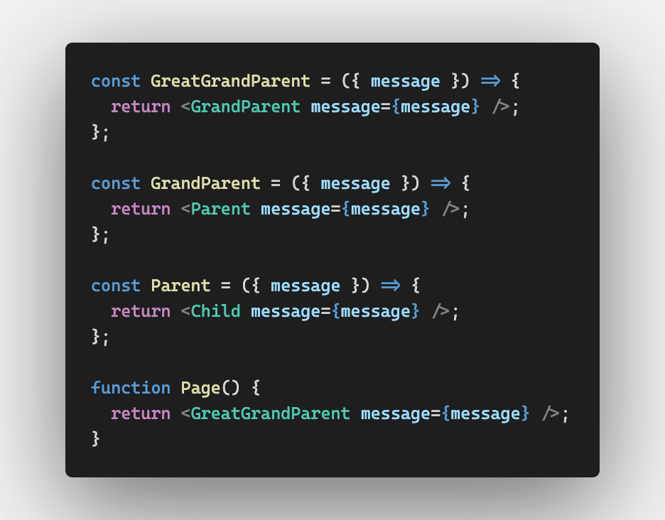

# `useContext` – Demystifying React Hooks (Pt. 6)


In this article, we will explore the `useContext` Hook in React and how it can help us eliminate
prop drilling and create cleaner and more organized code. We will start by understanding the concept
of prop drilling and its limitations, and then we will refactor some code to demonstrate how
`useContext` can provide an alternate solution.

## What is Prop Drilling?

Prop drilling refers to the passing props through multiple layers of components to reach a deeply
nested component that needs access to the data. In large applications with complex component
hierarchies, prop drilling can lead to code that is hard to maintain and understand.



As your application grows, it's easy to see how this quickly becomes unreadable and unmaintainable
for other developers.

Let's consider our simple Dark Theme Toggle starter code. To spin up our application:

- `cd client`
- `npm install`
- `npm run dev`
- open `http://localhost:5173/` in your browser

In App.jsx, we habve the state and functionality of our Dark Theme Toggle. Notice we dynamically set
the `className` based on our `theme` state.

```js
<div className={theme}>
```

We then pass `theme` and `toggleTheme` down to the `NavBar` component as props.

```js
<NavBar
  theme={theme}
  toggleTheme={toggleTheme}
/>
```

In NavBar.js we destructure our props and pass them down to children.

```js
const NavBar = ({ theme, toggleTheme }) => {
  return (
    <nav>
      <ThemeToggle toggleTheme={toggleTheme} />
      <ThemeLabel theme={theme} />
    </nav>
  );
};

export default NavBar;
```

Then, in `ThemeLabel.jsx` and `ThemeToggle.jsx` we actually make use of these props.

```js
return <div>Theme: {theme}</div>;
```

```js
    <div
      className='theme-slider-toggle'
      onClick={toggleTheme}
    >
```

This is a simple example, but imagine if we had a more complex application with many more components
that each needed access to our `theme` state and setter function. It would get really messy really
fast.

## Limitations of Prop Drilling

Code Maintainability: As the application grows and the component hierarchy becomes more complex, it
becomes challenging to track where the props are being passed and which components are dependent on
them. It can make the code harder to understand and maintain.

Prop Clutter: Prop drilling can lead to a large number of props being passed down to components that
don't directly use them. This creates clutter in the component code and can make it harder to
identify the props that are actually relevant.

Brittleness: If the structure of the component hierarchy changes, it requires updating the prop
passing logic at multiple levels. This can introduce bugs and make the code more brittle.

## Introducing `useContext`

According to the [React Documentation](https://react.dev/reference/react/useContext), context lets a
component receive information from distant parents without passing it as props. And `useContext` is
a React Hook that lets you read and subscribe to context from your component. By leveraging the
`useContext` Hook, you're able to access data from within any given component without having to pass
props down.

## Refactoring with useContext

### Step 1: Create a Context and Provider

We'll start by creating our context. Since you're able to have multiple contexts in any given app,
convention is to house them in a `contexts` directory. So in your `src` directory, create a new
`context` directory. As always, we want our names to be short yet descriptive. We'll be using this
context to manage the theme of our application, so we'll call it `ThemeContext`.

In `/context/ThemeContext.js` import `createContext` from `'react'`.

```js
import { createContext } from 'react';
```

We'll then create a new `const` called `ThemeContext` and assign it the return value of
`createContext()`.

```js
const ThemeContext = createContext();
```

Next, it's always safest to pass in a default value for our ThemeContext. This will be the value
that is used if a component does not have a matching Provider above it in the tree. More on that
later.

```js
const ThemeContext = createContext('light');
```

Then we'll export our ThemeContext as the default export.

```js
const ThemeContext = createContext('light');

export default ThemeContext;
```

Next, in the same file, we need to create what's called the `Provider`. The Provider is a component
that makes the data provided by the Context available to all children components. We'll create and
export a new functional component called `ThemeProvider` that takes in a `children` prop.

```js
export const ThemeProvider = ({ children }) => {
  return <div>{children}</div>;
};
```

Our return statement may look a bit foreign if it's your first time seeing this. Insead of returning
normal HTML elements, we'll wrap our `children` prop in `ThemeContext.Provider`

```js
export const ThemeProvider = ({ children }) => {
  return <ThemeContext.Provider>{children}</ThemeContext.Provider>;
};
```

Though it kind of feels like it, this `Provider` object isn't magic. `Provider` is being built onto
our `ThemeContext` by the `createContext` funtion which we called earler.

When we return a provider, it expects a `value` prop. As you might imagine, this is the value that
we want to make available to other parts of our application. In our case, it's our `theme` state and
`toggleTheme` setter function. So let's import `useState` and recreate those before the `return` of
our `ThemeProvider` component.

```js
export const ThemeProvider = ({ children }) => {
  const [theme, setTheme] = useState('light');

  const toggleTheme = () => {
    setTheme(prevTheme => (prevTheme === 'light' ? 'dark' : 'light'));
  };

  return <ThemeContext.Provider>{children}</ThemeContext.Provider>;
};
```

We'll then return the `Provider` component with the `value` prop set to an object with a `theme`
property and a `toggleTheme` property.

```js
<ThemeContext.Provider value={{ theme, toggleTheme }}>{children}</ThemeContext.Provider>
```

So by now, your `ThemeContext.js` file should look like this:

```js
import { createContext, useState } from 'react';

const ThemeContext = createContext('light');

export const ThemeProvider = ({ children }) => {
  const [theme, setTheme] = useState('light');

  const toggleTheme = () => {
    setTheme(prevTheme => (prevTheme === 'light' ? 'dark' : 'light'));
  };

  return <ThemeContext.Provider value={{ theme, toggleTheme }}>{children}</ThemeContext.Provider>;
};

export default ThemeContext;
```

A quick note in case you haven't encountered this yet. As we're doing here, it is possible to pass
in a function in as the argument to your state setter function. Because setting state is an
asynchronous operation, this is most often done when the next state depends directly on the previous
value. If this interest you, you can read more about it in the React Docs
[here](https://react.dev/reference/react/useState#setstate).

### Step 2: Wrap the App in the Provider

The contexts we create are **ONLY** avaialble to components that are **children** (direct or
indirect) of the Provider.

Since our `App.jsx` file needs to consume our `ThemeContext`, in order to make our `ThemeContext`
available to our entire application, we need to wrap our `App` component in the `ThemeProvider`
component we just created. For that, we'll head over to `main.jsx` and import our `ThemeProvider`
component.

```js
import { ThemeProvider } from './context/ThemeContext';
```

Then we'll wrap our `App` component in the `ThemeProvider` component.

```js
import React from 'react';
import ReactDOM from 'react-dom/client';
import App from './App.jsx';
import './index.css';
import { ThemeProvider } from './context/ThemeContext.jsx';

ReactDOM.createRoot(document.getElementById('root')).render(
  <ThemeProvider>
    <App />
  </ThemeProvider>,
);
```

Now that we've created our `ThemeContext` and wrapped our `App` in the `ThemeProvider`, we can
access our `ThemeContext` in any child component.

### Step 3: Consume the Context

Since we have everything set up, it's time to consume (or use) or context. We'll start by importing
our `ThemeContext` into `App.jsx`.

In `App.jsx`

```js
import ThemeContext from './context/ThemeContext';
```

Then we'll use the `useContext` Hook to consume our `ThemeContext` and destructure the `theme`
object from the return value.

```js
const { theme } = useContext(ThemeContext);
```

And now that our `theme` is coming from the `useContext` Hook, we can remove the local `theme` state
and the `useState` import from `App.jsx`.

In App.jsx:

```js
import './index.css';
import { useContext } from 'react';
import NavBar from './components/Navbar';
import ThemeContext from './context/ThemeContext';

function App() {
  const { theme } = useContext(ThemeContext);
  const toggleTheme = () => {
    setTheme(prevTheme => (prevTheme === 'light' ? 'dark' : 'light'));
  };

  return (
    <div className={theme}>
      <NavBar
        theme={theme}
        toggleTheme={toggleTheme}
      />
    </div>
  );
}

export default App;
```

## You Do:

In `ThemeToggle.jsx`

- import `ThemeContext` and `useContext`
- create a `toggleTheme` `const` with `useContext`.
  - remember to pass `ThemeContext` as the argument and destructure `toggleTheme` from the return
    value
- remove the destructured `toggleTheme` prop from `ThemeToggle` component

In `ThemeLabel.jsx`

- import `ThemeContext` and `useContext`
- create a `theme` `const` with `useContext`
  - remember to pass `ThemeContext` as the argument and destructure `theme` from the return value
- remove the destructured `theme` prop from `ThemeLabel` component

Great work!

<details>
<summary>
Refactored <code>ThemeLabel.jsx</code></summary>

```js
import { useContext } from 'react';
import ThemeContext from '../context/ThemeContext';

const ThemeLabel = () => {
  const { theme } = useContext(ThemeContext);

  return <div>Theme: {theme}</div>;
};
export default ThemeLabel;
```

</details>
<details>
<summary>Refactored <code>ThemeToggle.jsx</code></summary>

```js
import { FiSun, FiMoon } from 'react-icons/fi';
import { useContext } from 'react';
import ThemeContext from '../context/ThemeContext';

const ThemeToggle = () => {
  const { toggleTheme } = useContext(ThemeContext);

  return (
    <div
      className='theme-slider-toggle'
      onClick={toggleTheme}
    >
      <div className='toggle'>
        <div className='slider' />
        <div className='icon-container'>
          <FiSun className='sun-icon' />
          <div className='spacer'></div>
          <FiMoon className='moon-icon' />
        </div>
      </div>
    </div>
  );
};

export default ThemeToggle;
```

</details>
<br/>
And finally, now that none of our children components are using props, let's clean up all of their
parent components.

In `NavBar.jsx` we no longer need to pass props through to `ThemeLabel` or `ThemeToggle`.

```js
<ThemeToggle />
<ThemeLabel />
```

And with those references gone, `NavBar` no longer needs props at all.

<details>
<summary>Refactored <code>Navbar.jsx</code></summary>

```js
import ThemeLabel from './ThemeLabel';
import ThemeToggle from './ThemeToggle';

const NavBar = () => {
  return (
    <nav>
      <ThemeToggle />
      <ThemeLabel />
    </nav>
  );
};

export default NavBar;
```

</details>

Next, let's go up one level, back to `App.jsx`. `NavBar` no longer requires props so we can remove
those. And because we defined `toggleTheme` inside our `ThemeContext`, we can remove the definition
from `App.jsx`.

<details>
<summary>Refactored <code>App.jsx</code></summary>

```js
import './index.css';
import { useContext } from 'react';
import NavBar from './components/Navbar';
import ThemeContext from './context/ThemeContext';

function App() {
  const { theme } = useContext(ThemeContext);
  return (
    <div className={theme}>
      <NavBar />
    </div>
  );
}

export default App;
```

</details>

And finally, we have a refactored Dark Mode Toggle using React's `useContext` Hook!

## Conclusion

In this article, we learned how React's `useContext` Hook can help us eliminate prop drilling and
create cleaner and more organized code. We started by understanding the concept of prop drilling and
its limitations, and then we refactored some code to demonstrate how `useContext` can provide an
alternate solution.

If you'd like to take a deeper dive with `useContext`, check out the
[React Docs](https://react.dev/reference/react/useContext) for more information.
