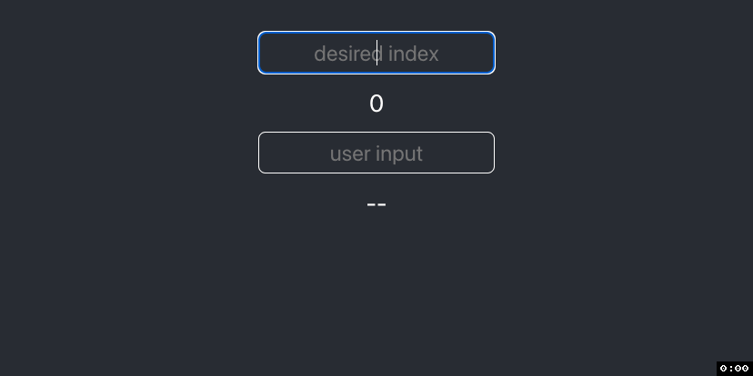

<<<<<<< HEAD
# `useCallback` – Demystifying React Hooks (Pt. 1)


In this article, we will explore when and how to use React’s `useCallback` hook
and a mistake made by most Junior Developers.

If you'd like, you can skim this as a
[Medium](https://medium.com/@austinrt/demystifying-react-hooks-usecallback-7c78fac08947)
or [dev.to](https://dev.to/austinrt/demystifying-react-hooks-usecallback-4618)
article.

## Getting Started

=======
# `useMemo` – Demystifying React Hooks (Pt. 2)


In this article, we will explore when and how to use React's `useMemo` Hook to
increase your app's performance.

## Getting Started

Buckle up and strap in. This article is on the heavier side for both theory and
length. </br> </br>  If you'd like, you can skim this as a
[Medium](https://medium.com/@austinrt/demystifying-react-hooks-usememo-1219661d0af0)
or [dev.to](https://dev.to/austinrt/demystifying-react-hooks-usememo-28d4)
article.

>>>>>>> memo/main
- `fork and clone`
- `cd client`
- `npm i`
- `npm start`

<<<<<<< HEAD
## Referential Equality

Referential Equality is a foundational concept in both JavaScript and Computer
Science as a whole. So let's start with a demonstration of it in action.

You can simply read along or run `referentialEquality.js` to observe the output.

```js
console.log(1 === 1);
// prints true
```

When evaluating whether the `integer 1` is strictly equal to the `integer 1`,
the console prints `true`. This is because, well... the `integer 1` **is**
strictly equal to the `integer 1`.

We see the same result when evaluating two strings.

```js
console.log('Referential Equality' === 'Referential Equality');
// prints true
```

Obviously, this will always be the case for two
[primitive data types](https://developer.mozilla.org/en-US/docs/Glossary/Primitive)
of the same value.

Now, what about data structures? For example, two object literals with the same
key/value pairs? What about empty object literals?

```js
console.log({ a: 1 } === { a: 1 });
// prints false
```

Why would this print `false`? When comparing whether these two object literals
are strictly equal, JavaScript uses their respective **_memory addresses_**.

In other words, these two objects may contain the same **values**, but they're
not **referencing the same object**. They _look_ the same but occupy two
different _spaces in memory_.

The same applies whether you're comparing two object literals, two array
literals, or two functions!

```js
console.log({} === {});
// prints false

console.log([1, 2, 3] === [1, 2, 3]);
// prints false

console.log([] === []);
// prints false
```

To demonstrate this further, we will define a function `func`, which returns an
anonymous function that, in turn, returns something else (_like a JSX element_).

```js
const func = () => {
  return () => 'This is a pretend component.';
};
```

We will then assign two different functions, `firstRender` and `secondRender`,
equal to the value returned by `func`.

```js
const firstRender = func();

const secondRender = func();
```

> Think of <code>func</code> as your React functional component, while
> `firstRender` is a function _inside_ of it on the first render, and
> <code>secondRender</code> is a function _inside_ of it on the second render.

Even though `firstRender` and `secondRender` look the same, return the same
value, and are even assigned their value from the same definition, they do not
have _referential equality_. As a result, every time the parent component
renders, it redefines this function.

```js
console.log(firstRender === secondRender);
// false
```

Unfortunately, in JavaScript, it isn’t easy to print these memory addresses like
in Python, but for a slightly more in-depth explanation of reference vs. value,
take a look at
[this article](https://www.freecodecamp.org/news/how-to-get-a-grip-on-reference-vs-value-in-javascript-cba3f86da223/).

This topic can get dense, and you don't need to teach a class on it tonight. So
for now, just remember:

- primitive data type `===` primitive data type
- data structure `!==` data structure.

With referential equality out of the way, let's dive into our React code and see
why this is relevant.

# Starter Code

Start by looking through the provided code, then open your dev tools. We're
going to be using the browser's console in a bit.

After we spin up our app, open the `BookDetails.jsx` component and re-save. The
first thing we may notice in our React dev server is a common `WARNING` that
young developers tend to ignore. As you hit the workforce and start writing code
for production, your linters will be even more strict than what’s built into
`create-react-app`. `WARNINGS` will turn to `ERRORS`, and some linter rules
won't even allow you to push without addressing these `ERRORS`.

And brace yourself; most linters won't allow `console.logs` in your code. So the
earlier you learn the proper way, the better. So rather than ignore it, let’s
figure out how to treat it.

```
WARNING in [eslint]
src/components/BookDetails.jsx
  Line 18:6:  React Hook useEffect has a missing dependency: 'getBookDetails'. Either include it or remove the dependency array  react-hooks/exhaustive-deps

webpack compiled with 1 warning
```

**NOTE: you may first need to re-save BookDetails.jsx to create this `WARNING`**

If we dig into the
[React Docs](https://beta.reactjs.org/learn/synchronizing-with-effects#step-2-specify-the-effect-dependencies),
we can decode the semi-confusing proposed solutions to this `WARNING` as
follows:

---

Take a moment to think through the consequences of each option.

<details>
<summary>
1. Include the function definition inside of the <code>useEffect</code>
 </summary>
<blockquote>
We cannot call this function elsewhere unless we redefine it.
</blockquote>
 </details>

</br>

<details>
<summary>
2. Remove the dependency array.
</summary>
<blockquote>
This will trigger the <code>useEffect</code> <strong>every time</strong> the state or props change, typically causing an infinite re-render, and in our case, it could overload our API with infinite requests.
</blockquote>
</details>

</br>

<details>
<summary>
3. Remove the function call from the <code>useEffect</code>.
</summary>
<blockquote>
The function won't get called.
</blockquote>
</details>

</br>

<details>
<summary>
4. Include the function in the dependency array.
</summary>
<blockquote>
The first time the component renders, it will define our function, which will trigger the useEffect, which will cause the component to re-render, which will redefine the function, which will trigger the useEffect, which will cause the component to re-render, which will redefine the function...
</blockquote>
</details>
</br>

_So ...what's a developer to do?_

---

The simplest and preferred solution would be to 'include it,' that is, move the
`getBookDetails` function definition inside the `useEffect`. This adheres to an
Object-Oriented Programming principal known as
[Encapsulation](https://stackify.com/oop-concept-for-beginners-what-is-encapsulation/).

But let’s say we know we need to call the function elsewhere. Should we redefine
it later? That’s not very DRY of us.

Let’s change our dependency array to include our function reference. Your
`useEffect` should now look like this.

```js
useEffect(() => {
  getBookDetails();
}, [getBookDetails]);
```

And `getBookDetails` remains defined **above** the `useEffect`.

```js
const getBookDetails = async () => {
  const { data } = await axios.get(`${BASE_URL}/${id}`);
  setBook(data);
};
```

Now we have a new `WARNING`:

```
WARNING in [eslint]
src/components/BookDetails.jsx
  Line 10:9:  The 'getBookDetails' function makes the dependencies of useEffect Hook (at line 18) change on every render. Move it inside the useEffect callback. Alternatively, wrap the definition of 'getBookDetails' in its own useCallback() Hook  react-hooks/exhaustive-deps

webpack compiled with 1 warning
```

## Enter the `useCallback` Hook

In short, the `useCallback` hook allows you to cache, or ‘memoize,’ a function
between re-renders of your component. It performs a similar task to `useMemo`,
the nuances of which we will get into in a different article.

If the nitty-gritty of this interests you, you can read more about it in the
[React docs](https://beta.reactjs.org/apis/react/useCallback).

Please notice their warning:

- You should only rely on <code>useCallback</code> as a performance
  optimization. If your code doesn’t work without it, find the underlying
  problem and fix it first. Then you may add <code>useCallback</code> to improve
  performance. <br>

## `useCallback` Syntax

`useCallback` syntax is very similar to the `useEffect` syntax, which we already
know. Look at the skeletons of each.

```js
useEffect(() => {}, []);

useCallback(() => {}, []);
```

The slight difference is with `useEffect`, we tell the anonymous function to
execute our function while with `useCallback`, we assign the return value to a
reference to be called elsewhere.

First, we will import `useCallback` from `'react'`. Rather than adding a new
line, it’s best to destructure it along with our other imports.

```js
import { useState, useEffect, useCallback } from 'react';
```

Now we can assign `getBookDetails` to the value returned from a `useCallback`
function call.

```js
const getBookDetails = useCallback();
```

Then we add all the syntax for `useCallback`. Remember your dependency array!

```js
const getBookDetails = useCallback(() => {}, []);
```

In our example, we need `async` before our parameters.

```js
const getBookDetails = useCallback(async () => {}, []);
```

And finally, we add the logic of our function into the code block.

```js
const getBookDetails = useCallback(async () => {
  const { data } = await axios.get(`${BASE_URL}/${id}`);
  setBook(data);
}, []);
```

Once we save, we get… another `WARNING`.

```
WARNING in [eslint]
src/components/BookDetails.jsx
  Line 14:6:  React Hook useCallback has a missing dependency: 'id'. Either include it or remove the dependency array  react-hooks/exhaustive-deps
=======
## Starter Code

We'll begin with a quick overview of our starter code. In `App.js`, you'll find
a function name "`jacobsthal`," two pieces of state, and a variable named
"`calculation`". Notice we wrapped `jacobsthal` in a `useCallback` Hook, and
`calculation` is the returned value from calling `jacobsthal`.

The JSX renders both inputs and their respective values. If you need a refresher
on what service the `useCallback` Hook provides, I'd suggest you pause here and
give my
<a href="https://medium.com/@austinrt/demystifying-react-Hooks-usecallback-7c78fac08947">`useCallback`</a>
article a quick read.

```js
import './App.css';
import { useState, useCallback } from 'react';

function App() {
  const [number, setNumber] = useState('');
  const [input, setInput] = useState('');

  const jacobsthal = useCallback(n => {
    if (n < 2) return n;
    return jacobsthal(n - 1) + 2 * jacobsthal(n - 2);
  }, []);

  const calculation = jacobsthal(number);

  return (
    <div>
      <main>
        <section>
          <div className='user-input'>
            <input
              type='text'
              value={number}
              placeholder='desired index'
              onChange={e => {
                setNumber(e.target.value);
              }}
            />
          </div>
          <div className='result'>{calculation || 0}</div>
        </section>
        <section>
          <div className='user-input'>
            <input
              type='text'
              value={input}
              placeholder='user input'
              onChange={e => {
                setInput(e.target.value);
              }}
            />
          </div>
          <div className='result'>{input || '--'}</div>
        </section>
      </main>
    </div>
  );
}

export default App;
```

</br>
<blockquote>
Our <code>jacobsthal</code> function is a simple, <a href="https://www.geeksforgeeks.org/javascript-memoization/">recursive</a> function that returns the <a href="https://en.wikipedia.org/wiki/Jacobsthal_number">Jacobsthal Number</a> at a given index. The specifics of the code and Jacobsthal Number don't matter for <code>useMemo</code>. All we care about is that it's defined <strong>within</strong> our component, hence the implementation of <code>useCallback</code>, and that it's computationally expensive.
</blockquote>
</br>

If we provide a small value to the `number` input, our React app behaves as
expected, snappily rendering the result. However, as we increase the value of
our input, while the app still provides the desired output, it takes
increasingly longer to render.



## Why is This Happening?

Thirty-five will be our test case because it is slow enough to be annoying but
still testable. So we'll type 35 and wait for the output to calculate.

Now start typing into the second input. See how slow it is to render? That's
because when the input changed, the **entire** component re-rendered, and our
expensive function recalculated the output before re-rendering, even though our
output didn't change.

This is obviously a problem.


<blockquote>A Quick Aside:

Junior Developers make this mistake far too often. You don't always need
<code>useState</code> for your forms. I'll even propose that you **usually
don't**. If no part of your application needs to see the real-time value, like
when submitting a form to an API, you should be using <code>useRef</code>
instead. We will get into how and why in a later article.</blockquote>

So with the stage set and the curtains drawn, how do we resolve the issue at
hand?

## Memoization

Memoization is a Programming technique that stores the **results** of a function
call, so the next time you call that function, it doesn't have to recalculate
the output. Instead, it can return the stored result, saving
[time complexity](https://www.freecodecamp.org/news/time-complexity-of-algorithms/)
with recursive functions.

That's all you need to know for now, but if you'd like a more in-depth
explanation, check out this
[Memoization in JavaScript](https://www.geeksforgeeks.org/javascript-memoization/)
article by GeeksforGeeks. And at the end of this article, we will refactor our
`jacobsthal` function to implement proper JavaScript memoization.

## `useMemo` vs. `useCallback`

To sum it up, `useCallback` stores the **definition** of the function, so it
doesn't unnecessarily **redefine** every render. `useCallback` creates
referential equality between instances of the function across renders.

Similarly, `useMemo` stores the **result** of the function call, so it doesn't
unnecessarily **recalculate** every render. `useMemo` creates referential
equality between instances of the value across renders.

You can already see how this is helpful and leads directly to the primary
purpose of `useMemeo`. In short, the aptly named `useMemo` Hook is React's
built-in memoization tool.

## `useMemo` in Action

Let's write some code!

We'll start by importing `useMemo` from `'react'`.

```js
import { useState, useCallback, useMemo } from 'react';
```

## `useMemo` Syntax

You guessed it, `useMemo` has a similar syntactical skeleton to both `useEffect`
and `useCallback`: an anonymous callback function with a dependency array that
tracks a variable to tell our Hook when to trigger.

```js
useEffect = (() => {}, []);
useCallback = (() => {}, []);
useMemo = (() => {}, []);
```

As in our `useCallback` example, we want to cache what's **returned** from this
Hook. So we will assign our `calculation` variable to the return value of
`useMemo`, wrapping our function call in an anonymous callback.

_Remember to `return` the result of your function call so it is accessible by
`useMemo`!_

```js
const calculation = useMemo(() => {
  return jacobsthal(number);
}, []);
```

After we save, we'll notice a familiar warning from React. Our Hook is missing a
dependency.

```
WARNING in [eslint]
src/App.js
  Line 11:6:  React Hook useMemo has a missing dependency: 'number'. Either include it or remove the dependency array  react-Hooks/exhaustive-deps
>>>>>>> memo/main

webpack compiled with 1 warning
```

<<<<<<< HEAD
Let's think through this for a moment.

<details>
<summary>
Why should our dependency array track the <code>id</code> variable?
</summary>
<blockquote>
If the value of <code>id</code> changes, `getBookDetails` needs to hit a different endpoint, so React should redefine it. 
</blockquote>
</details>
</br>

After we add `id` to our dependency array, our finished `getBookDetails` and
`useEffect` functions should look like this. Look closely at the differences
between the way we implement the two hooks.

```js
const getBookDetails = useCallback(async () => {
  const { data } = await axios.get(`${BASE_URL}/${id}`);
  setBook(data);
}, [id]);

useEffect(() => {
  getBookDetails();
}, [getBookDetails]);
```

And finally, that’s it! We see green in our React dev server. A happy linter is
a happy Senior Developer. And a happy Senior Developer is a happy you!
=======
Before blindly obeying React's warnings, let's first think through the purpose
of this dependency array and the functionality it extends to our application.

The intent of dependency arrays with React Hooks is to trigger our Hook more
intentionally and specifically. When the value of the variable being `tracked`
changes, the Hook knows it's time to _do its thing_.

In our specific case, when `number` changes, we want our `jacobsthal` function
to recalculate the result.

So let's add `number` to our dependency array.

```js
const calculation = useMemo(() => {
  return jacobsthal(number);
}, [number]);
```

Now that we've memoized our function, let's test it out. We'll start by
typing 35. Our calculation still takes time because our `jacobsthal` function is
still computationally expensive. But now, when we type in the second input, our
React app is again snappy and responsive. It's no longer recalculating our
`jacobsthal` output because `number` has not changed.


## Conclusion (kind of)

Because we memoized the results of our function, we've created referential
equality and eliminated any unnecessary renders, making our React app more
performant.

If you only came here for the React piece, thanks so much for reading, and look
out for the `useRef` article next!

---

But what to do about our computationally expensive `jacobsthal` function? Time
to refactor.

We begin by creating a `previousValues` parameter with a default value of an
empty array. This will be our cache that we will later pass to our recursive
sequence. Doing so will spare our recursive sequence from working overtime.

```js
export const jacobsthal = (n, previousValues = []) => {
  if (n < 2) {
    return n;
  }
  return jacobsthal(n - 1) + 2 * jacobsthal(n - 2);
};
```

Next, inside our code block, we'll create a results variable. We will later
reassign the value, so we'll need to use our `let` keyword.

```js
export const jacobsthal = (n, previousValues = []) => {
  let result;
  if (n < 2) {
    return n;
  }
  return jacobsthal(n - 1) + 2 * jacobsthal(n - 2);
};
```

Instead of returning our computations directly, we'll explicitly wrap our
recursive sequence in an `else` block and assign our `return` options to
`result`.

```js
export const jacobsthal = (n, previousValues = []) => {
  let result;
  if (n < 2) {
    result = n;
  } else {
    result = jacobsthal(n - 1) + 2 * jacobsthal(n - 2);
  }
};
```

Now, after our conditionals have evaluated and assigned a value to `result`, we
set `previousValues` at index `n` equal to our current result, then return
`result`, thus caching this value and making it accessible as a `return`.

```js
export const jacobsthal = (n, previousValues = []) => {
  let result;
  if (n < 2) {
    result = n;
  } else {
    result = jacobsthal(n - 1) + 2 * jacobsthal(n - 2);
  }
  previousValues[n] = result;
  return result;
};
```

Next, the first thing our function should do is check to see if `previousValues`
at index `n` exists. If it does, we `return` it.

```js
export const jacobsthal = (n, previousValues = []) => {
  if (previousValues[n]) {
    return previousValues[n];
  }
  let result;
  if (n < 2) {
    result = n;
  } else {
    result = jacobsthal(n - 1) + 2 * jacobsthal(n - 2);
  }
  previousValues[n] = result;
  return result;
};
```

Lastly, we'll pass `previousValues` as an argument to our recursive sequence.

```js
export const jacobsthal = (n, previousValues = []) => {
  if (previousValues[n]) {
    return previousValues[n];
  }
  let result;
  if (n < 2) {
    result = n;
  } else {
    result =
      jacobsthal(n - 1, previousValues) + 2 * jacobsthal(n - 2, previousValues);
  }
  previousValues[n] = result;
  return result;
};
```

## Conclusions (for real this time)

_Whew_. We can now test our newly (and thoroughly) memoized component. Try 35
again. Pretty snappy, huh? So snappy, in fact, that if we enter 1026 as our
input, it's still responsive. Even calculating '`Infinity`' doesn't crash our
app. And yes, `useMemo` is still doing its thing.

There is no lag in our other input.


If you'd like to dive deeper with useMemo, you can learn more in the
[official React docs](https://beta.reactjs.org/apis/react/useMemo).
>>>>>>> memo/main

<hr/>
I’m always looking for new friends and colleagues. If you found this article
helpful and would like to connect, you can find me at any of my homes on the
web.

[GitHub](https://github.com/austin-rt) | [Twitter](https://twitter.com/0xStink)
| [LinkedIn](https://www.linkedin.com/in/austinrt) |
[Website](https://austinrt.io) | [Medium](https://austinrt.medium.com/) |
[Dev.to](https://dev.to/austinrt)

<hr/>

## Resources

<<<<<<< HEAD
- [useCallback](https://beta.reactjs.org/apis/react/useCallback)
- [JavaScript Primitive Data Types vs. Data Structures](https://developer.mozilla.org/en-US/docs/Glossary/Primitive)
- [Referential Equality](https://www.freecodecamp.org/news/how-to-get-a-grip-on-reference-vs-value-in-javascript-cba3f86da223/)
- [React Docs](https://beta.reactjs.org/learn/synchronizing-with-effects#step-2-specify-the-effect-dependencies)
- [Encapsulation](https://stackify.com/oop-concept-for-beginners-what-is-encapsulation/)
=======
- [useMemo](https://beta.reactjs.org/apis/react/useMemo)
- [useCallback](https://medium.com/@austinrt/demystifying-react-Hooks-usecallback-7c78fac08947)
- [Recursion](https://www.freecodecamp.org/news/understanding-recursion-in-javascript-1938884c6be8/)
- [Time Complexity](https://www.freecodecamp.org/news/time-complexity-of-algorithms/)
- [Memoization](https://www.geeksforgeeks.org/javascript-memoization/)
- [Jacobsthal Number](https://en.wikipedia.org/wiki/Jacobsthal_number)
>>>>>>> memo/main
